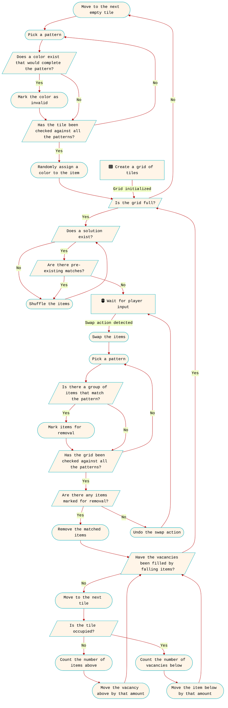
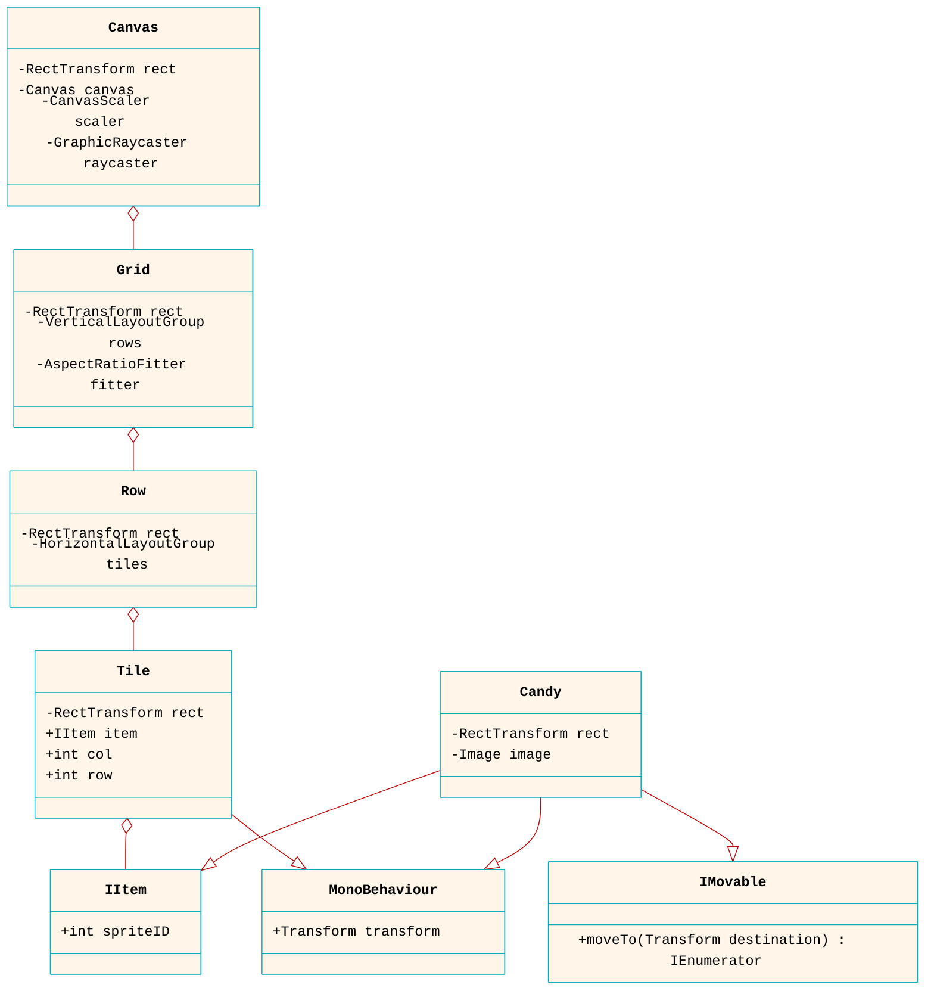

A match-3 game is a popular genre of puzzle game where the objective is to match three or more identical items by swapping. The matches can be made horizontally or vertically, and when a match is made, the matched items disappear, allowing new items to appear. In this post, I will take you through the fundamental steps to create a match-3 game in Unity. My focus will be on the programming aspect, utilizing free assets for other elements whenever possible.

According to [ChatGPT](https://chat.openai.com), the following are the essential components that need to be implemented to create a basic match-3 game:
- **Grid:** Create a grid structure to hold the game elements (e.g., candies, gems) arranged in rows and columns.
- **Spawning:** Generate the initial grid of game elements with random or predefined configurations.
- **Matching:** Detect and handle matches of three or more identical game elements horizontally or vertically. Remove the matched elements from the grid and award points or score to the player.
- **Refilling:** Fill the empty spaces created by falling elements with new game elements generated from the top. This ensures a continuous flow of elements in the grid.
- **Swapping:** Enable the player to swap adjacent game elements to create matches. Handle the logic for valid and invalid swaps, and update the grid accordingly.
- **Scoring:** Keep track of the player's score or points based on the matched elements and any additional scoring criteria you want to include.
- **Win and Lose Conditions:** Implement win and lose conditions based on specific goals or time limits. For example, the player may need to achieve a certain score within a specified number of moves or time.
- **User Interface:** Design and implement a user interface to display the game grid, score, and other relevant information. Include interactive elements such as buttons for swapping elements or triggering special moves.

## Design

Let's apply the [Single Responsibility Principle](https://en.wikipedia.org/wiki/Single-responsibility_principle) to define the subsystems of our game. The principle states that each class or module should have only one responsibility (one reason to change). Here are the subsystems we can define based on this principle:

- **ItemSpawner:** This class will be responsible for instantiating or updating the items. It ensures that new items are properly spawned and aligned within the grid.
- **GridScanner:** This class will handle the scanning of the grid for matches or possible solutions. It will trigger the necessary actions for spawning new items or shuffling existing items.
- **GridOrganizer:** This class will be responsible for rearranging the items in the grid and triggering item fall animations after matched items are destroyed.
- **InputHandler:** This class will be responsible for handling user inputs, managing swapping operations, and triggering actions to scan the grid for matches.

By separating these responsibilities into distinct subsystems, we ensure that each class has a clear and specific purpose. This enhances code readability, maintainability, and makes it easier to extend or modify the game logic without affecting unrelated components.

Communication between these modules is facilitated through events. To streamline this communication, we can declare the events in a [ScriptableObject](https://docs.unity3d.com/Manual/class-ScriptableObject.html). Each module can then reference this object to easily access the events and register their event handlers.

Before starting our development, it's a good idea to create a flowchart of the game to better understand the relationships between the subsystems and the logic behind decision making. This will provide a visual representation of the game's flow and help in organizing our development process. Don't worry if there are missing details; this is just a rough sketch to get us started.



## Grid

First, we need to create a grid of tiles where each tile will serve as a parent for an item. The tiles can be empty game objects acting as placeholders for newly spawned items, or they can be UI elements, which allow for easier scaling of the grid. In this case, we'll use Unity's uGUI elements to create the grid. The UML diagram below illustrates the relationship between the UI elements in the game scene:



In the diagram, the canvas serves as the root UI element. Under the canvas, we create a grid object that acts as a container for individual rows. Each row can contain multiple tile objects. For every tile, we instantiate an item object and make it the child of the tile. It's important to note that `Row`, `Tile`, and `Item` are saved as [prefabs](https://docs.unity3d.com/Manual/Prefabs.html), which allows for easy duplication and reuse throughout the game.

The UI elements constituting the grid can be created in the editor or instantiated and configured procedurally in the code. In this case, we have chosen the latter approach to allow dynamic configuration of the grid size. The class responsible for creating the grid is called `GridCreator`. It contains a 2D array of tile objects to store references to the tiles on the grid. Each tile keeps a reference to its child item for easy access.

Instead of having an `Item` class, we define an `IItem` interface. The `Tile` class references any object that implements this interface. For instance, the `Candy` class implements the `IItem` interface, so any instance of `Candy` can be used wherever an object of type `IItem` is expected. This adheres to the [Liskov Substitution Principle](https://en.wikipedia.org/wiki/Liskov_substitution_principle). In C#, you can check if an object of type `B` is also of type `A` and use `B` as `A` wherever necessary, as shown below:

```cs
var candy = new Candy();
if (candy is IItem)
  var item = candy as IItem;
```

The advantage of creating such abstractions is that they allow for introducing new classes later on that can be placed on the grid, similar to candies, but without necessarily behaving like candies. For example, these new item types can be obstacles that cannot be moved, unlike candies. As stated by the [Interface Segregation Principle](https://en.wikipedia.org/wiki/Interface_segregation_principle), they do not have to implement the `IMovable` interface, as the `Candy` class does. They only need to implement the `IItem` interface so that they can be referenced by the `Tile` class and extend the `MonoBehaviour` class, allowing them to be attached to tile objects.

For this project, we will only define the `Candy` class that implements the `IItem` interface. Therefore, throughout the text, we will refer to candies as "items".

## Spawning

After the grid is created or modified, such as through events, new items are spawned to fill the empty spots. In this context, "spawning" does not refer to instantiating new items, as object pooling is implemented, as I will discuss in [Matching](#matching). Instead, it refers to the process of assigning a new sprite ID to each 'destroyed' item in the grid. Initially, all these IDs are set to `-1`, indicating that the item's sprite/image is not rendered.

However, we need to take pre-existing matches into consideration during this process. To address this, we iterate through each pattern and remove sprite IDs that complete the pattern for the current tile from the list of available sprites. It is crucial to have a minimum of five different sprite choices to ensure that there is at least one available sprite for each position.

Since we are working with a 2D grid, it is logical to define each pattern using a 2D array. We can use a `bool` array where elements with a value of `true` are considered for pattern matching, while those with a value of `false` are ignored. We can declare a pattern as follows:

```cs
var pattern1x3 = new bool[1, 3] { { true, true, true } };
var pattern2x2 = new bool[2, 2] { { true, true }, { true, true } };
var pattern3x1 = new bool[3, 1] { { true }, { true }, { true } };
```

To simplify the process of adding new patterns, we can create a new class called `PatternManager`. This class will handle tasks such as checking for issues like overlapping patterns and resolving them when a new pattern is added to the list. Additionally, we can implement a translation function in this class to facilitate pattern addition. This function can take a string input, such as `"+--,-+-,--+"`, and convert it into a `bool` array representation of the pattern.

## Matching

To detect if some part of the grid matches a pattern, we can use a sliding window, which is a 2D array the size of the currently tested pattern. We move this window to all different positions within the grid and check if all sprite IDs inside this window that correspond to a `true` element in the pattern array are the same. If this is the case, there is a match, and the matched items are stored in a list or set so they can be removed after the grid is checked against each pattern.

When it comes to destroying matched items, it is advisable to avoid directly destroying the game objects to prevent performance issues associated with instantiating new objects and garbage collection. Instead, we can employ a technique called [object pooling](https://learn.unity.com/tutorial/introduction-to-object-pooling) to create the illusion of items disappearing and new ones appearing. One way to implement this is to hide the "destroyed" items by disabling their `Image` components or setting their `alpha` value to `0`. When it's time to spawn new items, we can re-enable the previously disabled components.

Since we will not physically destroy the item objects, we can instead set their sprite IDs to `-1` to indicate their removal. This approach allows other modules to utilize this information when reorganizing the grid. By setting the sprite IDs to -1, we convey that these items are no longer present while still retaining their object references for grid manipulation purposes.

## Refilling

Refilling involves spawning new items to replace the destroyed ones. However, in this case, the new items will not be directly spawned in place of the destroyed ones. Instead, they will fall from the top of the screen to their designated positions. Since object pooling is implemented, we need to reuse existing item objects rather than instantiating new ones.

The refilling process consists of rearranging the items in the grid. Items with a sprite ID of `-1` need to be moved to the top, while the other items will fall down by the number of empty places beneath them. Once the fall animations are complete, it is crucial to update the item references for each tile.

To provide a more rewarding experience, we can temporarily disable the checks for pre-existing matches while assigning new sprite IDs. By doing so, the newly spawned items have the opportunity to create additional matches, allowing the player to earn bonus scores.

## Swapping

To detect swap actions, we declare two events, `PointerDown` and `PointerUp`, for each tile.

```cs
public Action<Tile> PointerDown;
public Action<Tile> PointerUp;
```

Then, inside the `InputHandler`, we loop through all tiles and register two functions, `OnPointerDown` and `OnPointerUp`, as listeners to these events.

```cs
void OnEnable() {
  foreach (var tile in grid) {
    tile.PointerDown += OnPointerDown;
    tile.PointerUp += OnPointerUp;
  }
}
```

In these functions, we set the source and target items that are going to be swapped, respectively.

```cs
void OnPointerDown(Tile tile) {
  sourceTile = tile;
}
void OnPointerUp(Tile tile) {
  var targetTile = tile;
  if (!swapping)
    Swap(first: sourceTile, second: targetTile);
}
```

The [RectTransform](https://docs.unity3d.com/ScriptReference/RectTransform.html) components on the tile objects will aid in identifying the tile within whose rectangle the touch or click event occurs, triggering the corresponding `PointerDown` or `PointerUp` event.

```cs
void OnPointerDown() {
  RectTransformUtility.ScreenPointToLocalPointInRectangle(
    rect: rectTransform,
    screenPoint: Input.mousePosition,
    cam: null,
    localPoint: out var localPoint
  );
  var rect = rectTransform.rect;
  if (rect.Contains(point: localPoint))
    PointerDown?.Invoke(obj: this);
}
void Update() {
  if (Input.GetMouseButtonDown(button: 0))
    OnPointerDown();
}
```

Once the source and target items are determined, we proceed to move them to each other's positions and then swap their parent tiles. After the swapping is complete, we check the grid for matches. If no match is detected, we reverse the swapping by moving the items back to their original positions. It is important to be cautious when implementing this to prevent infinite reverse calls. To address this, we can introduce a new boolean parameter in the swap function that indicates whether the action is reversible. This parameter will be set to `true` for user-initiated swap operations and `false` for restore operations.

```cs
IEnumerator SwapTiles(Tile first, Tile second, bool reversible = true) {
  // ...
  if (reversible) {
    var matchFound = gameData.GridScan?.Invoke();
    if (matchFound == true)
      gameData.GridOrganize?.Invoke();
    else
      yield return SwapTiles(
        first: second,
        second: first,
        reversible: false
      );
  }
}
```
